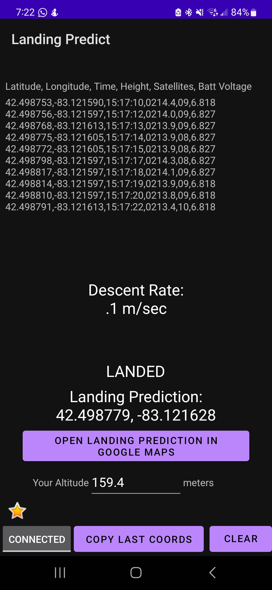

## UNFINISHED
# LandingPredictApp
An android app to connect to Arduinos and read telemetry data from a connected radio https://www.hopefuloverlook.casa/articles/high-power-rocketry/

This app reads in telemetry data strings from serial connection and uses that info to predict roughly where your kit rocket will land.

Here's a screenshot of a mostly up to date version. 

(NOTE: FAKED Coordinates, no live data, not my real location.)
